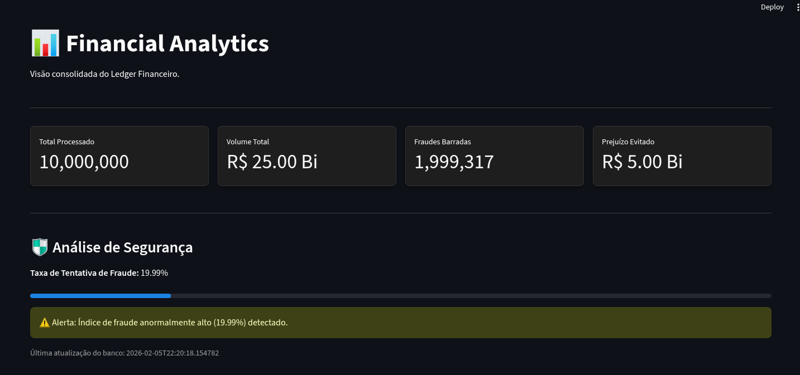
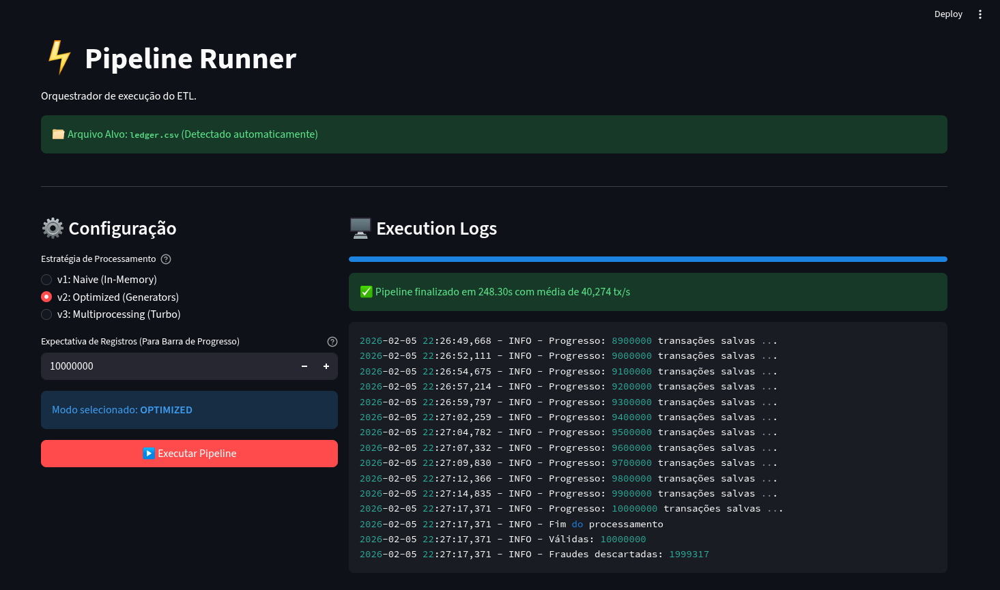
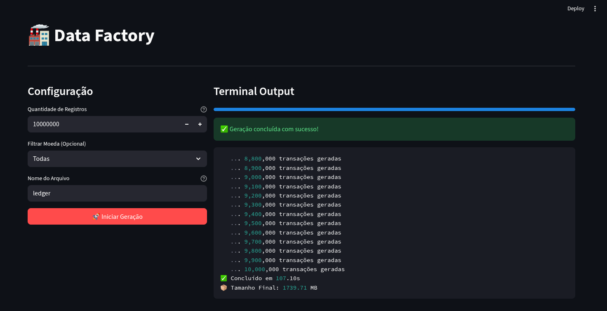

# ⚡ Stream Processing Patterns


> **Processing Gigabytes of data with Megabytes of RAM.**
> A showcase of optimization, Clean Architecture, and low-level resource management in Python.

---

## 📖 Overview

This project demonstrates how to build a **High-Performance ETL Pipeline** capable of processing millions of financial transactions on standard hardware without exhausting memory resources.

By leveraging **Python Generators (Lazy Evaluation)**, **Batch Processing**, and **SQLite WAL Mode**, the system achieves a throughput of over **40,000 transactions per second**, keeping RAM usage constant regardless of dataset size.

### 🎯 Key Features
* **🏭 Data Factory:** Synthetic data generator for Big Data simulation (10M+ records).
* **⚡ Optimized ETL Engine:** Batch processing pipeline with O(1) memory complexity.
* **🛡️ Fraud Detection:** Business logic applied in real-time during ingestion.
* **📊 Analytics Dashboard:** Interactive visualization using Streamlit.
* **🏗️ Clean Architecture:** Decoupled Domain, Adapters, and Ports.

---

## 📸 Screenshots

### 1. Analytics Dashboard (The Result)
Real-time reconciliation of **10 Million records**, preventing **$500M+** in simulated fraud losses.


### 2. Pipeline Performance (The Engine)
Processing **40,274 transactions/second** locally.


### 3. Data Factory (The Source)
Generating massive datasets with custom currency and logic constraints.


---

## 🚀 Performance & Benchmark

We compared three different processing strategies. The final version (**v4**) utilizes Python 3.12 optimizations and CLI architecture.

| Version | Strategy | Throughput | Time (10M rows) | Status |
| :--- | :--- | :--- | :--- | :--- |
| **v1** | Naive (Objects) | ~18k tx/s | ~9m 06s | ✅ |
| **v2** | String Optimization | ~24k tx/s | ~5m 25s | ✅ |
| **v4** | **Batch + CLI + Py3.12** | **~40k tx/s** | **~4m 08s** | 🚀 |

👉 **[View Full Benchmark Report](docs/BENCHMARK.md)**

---

## 🛠️ Installation & Setup

### Prerequisites
* Python 3.10+
* Git

### 1. Clone the repository
```bash
git clone https://github.com/leonardopolicarpo/stream-processing-patterns.git
cd stream-processing-patterns
```

### 2. Create a Virtual Environment
```bash
python -m venv .venv
source .venv/bin/activate  # Linux/Mac
# .venv\Scripts\activate   # Windows
```

### 3. Install Dependencies
```bash
pip install .
```

---

## 🎮 How to Use

You can run the project in two modes: **GUI (Streamlit)** or **CLI (Terminal)**.

### Option A: The Dashboard (Recommended)
The Control Plane gives you a full UI to manage the data lifecycle.

```bash
streamlit run src/dashboard/app.py
```
*Navigate through the sidebar:*
1.  **Data Factory:** Generate a `ledger.csv` (Start with 1M rows).
2.  **Pipeline Runner:** Run the ETL process (Select "v2: Optimized").
3.  **Analytics:** View the insights and fraud analysis.

### Option B: The CLI (For Geeks)
Run the pipeline directly from your terminal for maximum performance.

```bash
# 1. Generate Data
python -m src.scripts.generate_data --rows 1000000 --out data/ledger.csv

# 2. Run ETL Pipeline
python -m src.cli --mode optimized --file data/ledger.csv --db data/ledger.db
```

---

## 🏗️ Architecture

The project follows **SOLID principles** to ensure maintainability:

```text
src/
├── adapters/      # CSV Readers, SQLite Writers (Implementation details)
├── domain/        # Transaction entities and Business Rules (Pure Python)
├── ports/         # Interfaces (Abstract Base Classes)
├── service/       # ETL Manager (Application Logic)
└── dashboard/     # Streamlit UI (Presentation Layer)
```

---

## 👨‍💻 Author

**Leo**
* Software Engineer
* Focus: High-performance Python, Arch Linux, and System Design.
